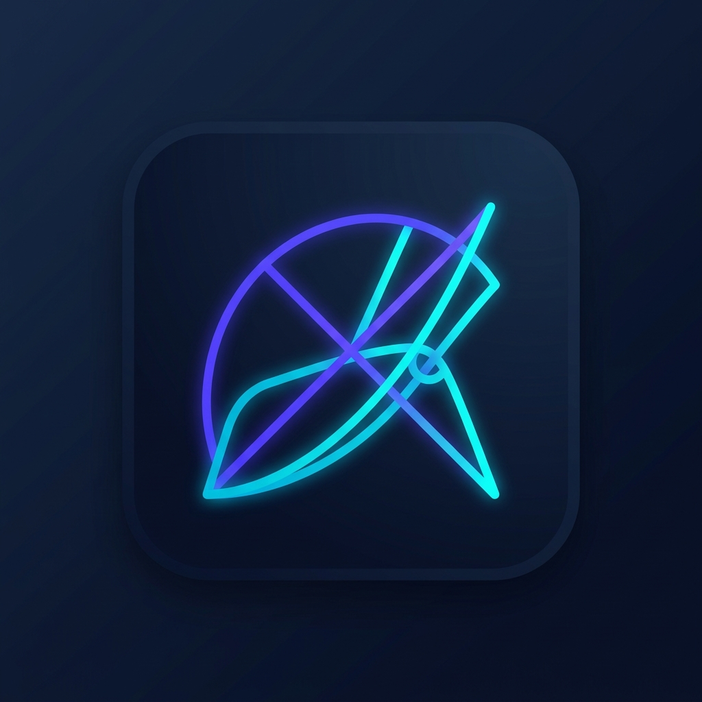
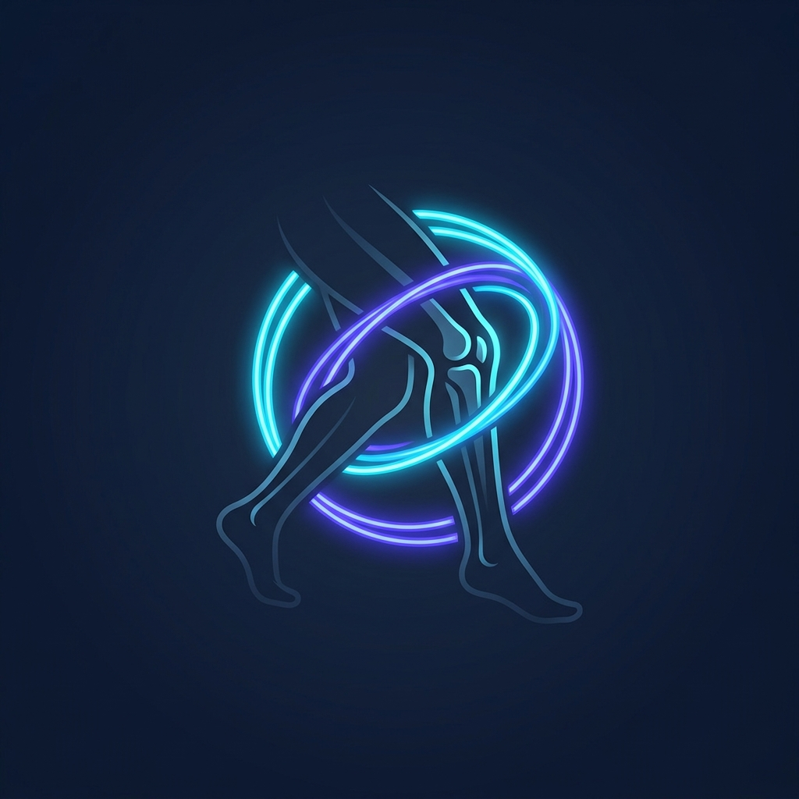

# Manual de Marca y Paleta de Colores

Este documento define la identidad visual, el logo y el sistema de diseño cromático para la aplicación móvil **GambApp** de rehabilitación física. Como expertos en diseño de interfaces de usuario (UI), hemos seleccionado una paleta moderna, dinámica y accesible que evoca salud, precisión y motivación.

---

## 1. Opciones de Logo de GambApp

Hemos generado tres variantes de diseño para el logo de la aplicación, todas alineadas con los tonos de marca (`Electric Indigo` y `Cyan Wave`) y el enfoque en la cinemática de la rodilla:

### Opción A: Línea Dinámica y Gradiente (Propuesta Principal)
*Descripción:* Combina líneas minimalistas que representan una pierna en movimiento, un nodo brillante que resalta la articulación de la rodilla y un arco brillante en gradiente que simboliza el progreso y la recuperación fluida.


### Opción B: Arco Geométrico de Extensión (Abstracto)
*Descripción:* Enfoque abstracto de trazos geométricos lineales que definen el arco angular de flexo-extensión de la rodilla. Ideal para una estética de panel o dashboard técnico.


### Opción C: Silueta Neon Kinésica (Foco Anatómico)
*Descripción:* Una silueta elegante estilo luz de neón que delinea la articulación de la rodilla y el muslo envueltos en anillos orbitales de energía cinética.


---

## 2. Paleta de Colores del Sistema de Diseño

Hemos optado por un enfoque de **alta fidelidad y contraste optimizado** (diseñado especialmente para ser legible bajo diferentes condiciones lumínicas, complementando el sensor de luz de la aplicación).

### A. Colores de Marca (Brand Colors)

*   **Primary (Electric Indigo): `#5F3CF6`**
    *   *Descripción:* Representa la tecnología, la estabilidad y la motivación en la rehabilitación. Usado para botones primarios, headers y estados de enfoque importantes.
*   **Secondary (Cyan Wave): `#06B6D4`**
    *   *Descripción:* Un color fresco y medicinal que transmite salud y vitalidad. Usado para destacar estadísticas, métricas y logros.
*   **Tertiary (Midnight Deep): `#0F172A`**
    *   *Descripción:* Base oscura de la marca que aporta premiumness y descanso visual, ideal para la elevación de tarjetas.

### B. Colores Semánticos de Rehabilitación (ROM Feedback)
Estos colores indican en tiempo real el ajuste del ángulo de las articulaciones del paciente contra la plantilla guía en la cámara:

| Nivel de Tolerancia | Color | Código Hex | Uso en UI (Compose / Canvas) |
| :--- | :--- | :--- | :--- |
| **Ideal** (Delta $\le 15^\circ$) | **Verde Esmeralda** | `#10B981` | Ángulo correcto. Trazo del esqueleto se ilumina en verde brillante. |
| **Warning** (Delta $\le 30^\circ$) | **Amarillo Ámbar** | `#F59E0B` | Desviación leve. Trazo amarillo que alerta al paciente de reajustar el cuerpo. |
| **Danger / SOS** (Fuera de rango) | **Rojo Coral** | `#EF4444` | Movimiento incorrecto o activación de llamada SOS/Emergencia. |

### C. Fondos y Neutros (Backgrounds & Neutrals)

#### **Modo Claro (Light Mode)**
*   **Base Background:** `#F8FAFC` (Gris Slate muy claro, reduce fatiga visual)
*   **Surface / Cards:** `#FFFFFF` (Blanco puro para elevar componentes)
*   **Border / Divider:** `#E2E8F0` (Gris suave para delimitar layouts)
*   **Text Primary:** `#0F172A` (Azul oscuro para lectura de alto contraste)
*   **Text Secondary:** `#64748B` (Gris medio para textos explicativos de tareas)

#### **Modo Oscuro (Dark Mode)**
*   **Base Background:** `#090D1A` (Azul noche profundo, reduce el consumo de batería)
*   **Surface / Cards:** `#151B2E` (Azul oscuro para tarjetas flotantes)
*   **Border / Divider:** `#1E293B` (Gris oscuro metálico)
*   **Text Primary:** `#F8FAFC` (Gris muy claro para máxima legibilidad)
*   **Text Secondary:** `#94A3B8` (Gris azulado para subtítulos)

---

## 3. Implementación en Jetpack Compose

Los desarrolladores del equipo pueden copiar e integrar directamente esta paleta en el archivo `ui/theme/Color.kt` del proyecto Android:

### `Color.kt`
```kotlin
package ar.edu.unlam.mobile.scaffolding.ui.theme

import androidx.compose.ui.graphics.Color

// Brand Tones
val ElectricIndigo = Color(0xFF5F3CF6)
val CyanWave = Color(0xFF06B6D4)
val MidnightDeep = Color(0xFF0F172A)

// Semantic Feedback
val EmeraldIdeal = Color(0xFF10B981)
val AmberWarning = Color(0xFFF59E0B)
val CoralDanger = Color(0xFFEF4444)

// Light Mode Neutrals
val LightBg = Color(0xFFF8FAFC)
val LightSurface = Color(0xFFFFFFFF)
val LightBorder = Color(0xFFE2E8F0)
val LightTextPrimary = Color(0xFF0F172A)
val LightTextSecondary = Color(0xFF64748B)

// Dark Mode Neutrals
val DarkBg = Color(0xFF090D1A)
val DarkSurface = Color(0xFF151B2E)
val DarkBorder = Color(0xFF1E293B)
val DarkTextPrimary = Color(0xFFF8FAFC)
val DarkTextSecondary = Color(0xFF94A3B8)
```

### Ejemplo de Uso del Gradiente de Marca en Botones o Encabezados
```kotlin
val BrandGradient = Brush.linearGradient(
    colors = listOf(ElectricIndigo, CyanWave)
)
```
